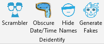

## Deidentify Tools

 

Creates custom buttons in Microsoft Excel that allow user to:

* Generate unique, [scrambled identifiers](./help%20files/Scrambler/Scrambler.md) from patient or user data.
* [Dither dates/times](./help%20files/ObscureDateTime/ObscureDateTime.md) to deidentify patients.
* [Replace names](./help%20files/HideDrNames/HideDrNames.md) with randomized code numbers.
* [Generate fake](./help%20files/GenerateFakes/GenerateFakes.md) patient information for testing.
