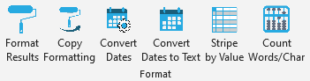

## Format Tools

 

Creates custom buttons in Microsoft Excel that allow user to:

* [Format a page](./help%20files/Format/Format.md) of results with bold & centered header, NULLs grayed out, etc.
* [Copy the formatting](./help%20files/CopyFormatting/CopyFormatting.md) from one sheet onto the next sheet(s).
* [Convert dates](./help%20files/ConvertMUMPS/ConvertMUMPS.md) from [MUMPS](https://en.wikipedia.org/wiki/MUMPS) to Excel standard.
* [Convert dates to text format](./help%20files/DateToText/DateToText.md) for easier import into R.
* [Highlight blocks of similar data](./help%20files/StripeByValue/StripeByValue.md)
* [Count words & characters](./help%20files/CountWords/CountWords.md)

