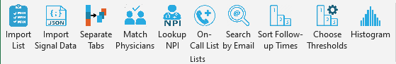

# List Tools

 

Creates custom buttons in Microsoft Excel that allow user to:

* [Turn a list](./help%20files/ImportList/ImportList.md) (of MRNs, ICD codes, etc.) into a SQL snippet that imports the column into a query.
* [Import Epic Signal data](./help%20files/ImportSignal/ImportSignal.md) from `.json` file.
* [Break up a long spreadsheet](./help%20files/SeparateTabs/SeparateTabs.md) into individual sheets, using the value of one column.
* [Match physicians](./help%20files/MatchPhysicians/MatchPhysicians.md) on two separate sheets.
* [Look up provider information](./help%20files/LookupNPI/LookupNPI.md) from their National Provider Identifier ([NPI](https://www.cms.gov/priorities/key-initiatives/burden-reduction/administrative-simplification/unique-identifiers/npis)) number.
* [Process a physician oncall list](./help%20files/OnCallList/OnCallList.md) into SQL code for import.
* [Search UCSD Blink](./help%20files/SearchByEmail/SearchByEmail.md) for provider names using email addresses.
* [Turn text like "2-3 weeks" into a category](./help%20files/SortFollowUpTimes/SortFollowUpTimes.md) like "routine/medium/high" priority.
* [Set thresholds](./help%20files/ChooseThresholds/ChooseThresholds.md) for text parsing into priorities.
* [Build histogram table](./help%20files/BuildHistogram/BuildHistogram.md) from existing data.