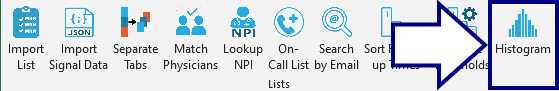
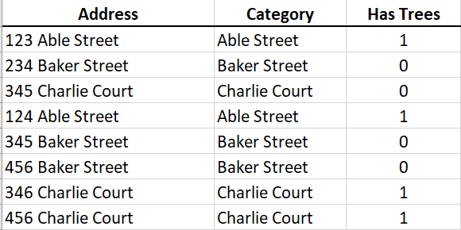
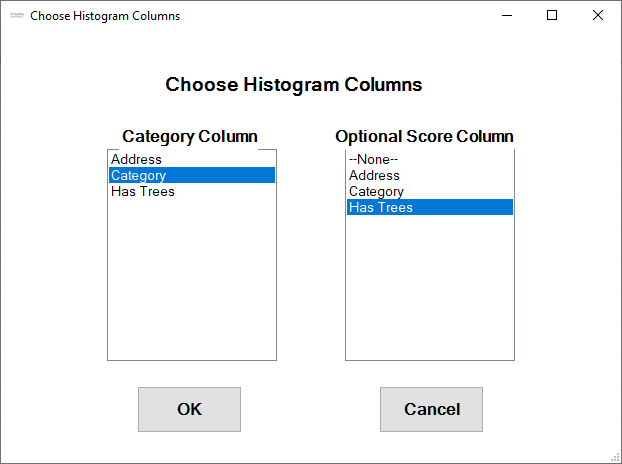
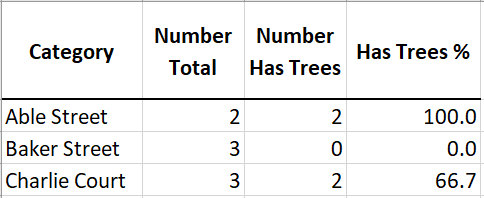

## Build Histogram

This tool builds a histogram table from spreadsheet data. It can work in two modes:

1. Just counting the number of occurrences of some category.
2. Counting the number of times a category had some attribute.

For example, in this data table, we record various home addresses and categorize them by their street name. In each case, we record when the house has shade trees on their property:

Selecting the `Histogram` tool brings up this form for us to select the category column and whether we're counting the presence/absence of some "score" column:

The output shows the number present in each category (street) and what fraction of homes on that street have shade trees:

[BACK](../../README.md)
