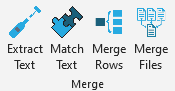

## Merge Tools

 

Creates custom buttons in Microsoft Excel that allow user to:

### Merge data sources

* [Extract text](./help%20files/ExtractText/ExtractText.md) from HTML package.
* [Match text](./help%20files/MatchText/MatchText.md) in different columns.
* [Merge rows](./help%20files/MergeRows/MergeRows.md) across dates.
* Merge multiple query output files into one spreadsheet.
