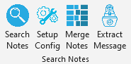

## Notes Tools

 

Creates custom buttons in Microsoft Excel that allow user to:

* [Scan `Notes` fields](./help%20files/SearchNotes/SearchNotes.md) for keywords, creating new columns.
* [Merge notes](./help%20files/MergeNotes/MergeNotes.md) from one sheet into another according to some index column (like CSN).
* Extract the payload message from a message thread.
