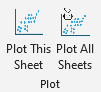

## Plot Tools

 

Creates custom buttons in Microsoft Excel that allow user to:

* [Plot x,y data](./help%20files/PlotOneSheet/PlotOneSheet.md) from selected columns.
* [Plot those columns on every sheet](./help%20files/PlotAllSheets/PlotAllSheets.md).

