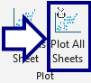
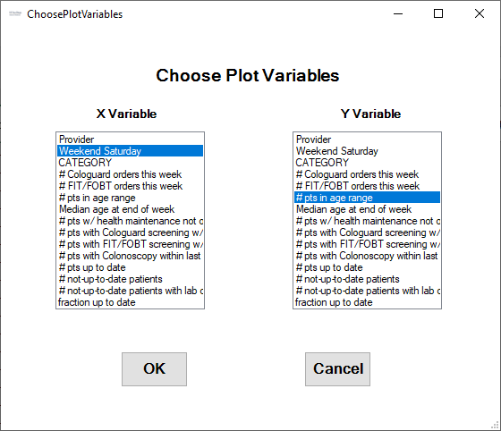

## Plot All Sheets

The app asks the user to select which columns to use for the plot X, Y variables:

...then creates a simple scatter plot on every sheet in which it finds those two column names.

[BACK](../../README.md)