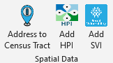

## Spatial Tools

 

Creates custom buttons in Microsoft Excel that allow user to:

* [Convert addresses into Census tract numbers](./help%20files/FindCensusTract/FindCensusTract.md)
* [Lookup Healthy Places Index](./help%20files/HPI/) ([HPI](https://www.healthyplacesindex.org/)) from Census tract
* [Lookup Social Vulnerability Index](./help%20files/SVI/SVI.md) ([SVI](https://www.atsdr.cdc.gov/placeandhealth/svi/index.html)) from Census tract.
