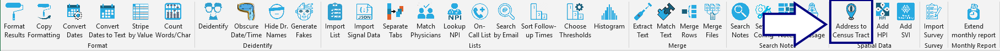
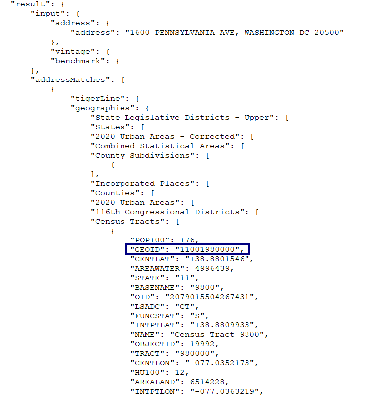

## Find Census Tract



#### Finding the census tract number:

From the patient's address, the app looks up their exact census tract number using the US Census Bureau's [online geocoding service](https://geocoding.geo.census.gov/geocoder/Geocoding_Services_API.html). Here's an example of the query & response (the census tract number is here called *GEOID*):

Query:
```
https://geocoding.geo.census.gov/geocoder/geographies/onelineaddress?address=1600%20PENNSYLVANIA%20AVE%2C%20WASHINGTON%20DC%2020500&benchmark=2020&vintage=2020&format=json
```
Response:



[BACK](../../README.md)