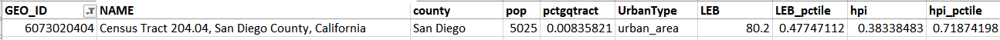

## Lookup Healthy Places Index (HPI)

Researchers sometimes ask for the [Healthy Places Index](https://https://www.healthyplacesindex.org/) of a patient's neighborhood:

> ...the HPI maps data on social conditions that drive health — like education, job opportunities, clean air and water, and other indicators that are positively associated with life expectancy at birth. Community leaders, policymakers, academics, and other stakeholders use the HPI to compare the health and well-being of communities, identify health inequities and quantify the factors that shape health.

We can provide this information by using the patient's [census tract number](https://www.census.gov/programs-surveys/geography/about/glossary.html#par_textimage_13), then retrieving their HPI info from a document published by the [Public Health Alliance](https://www.thepublichealthalliance.org/), which lists the HPI information for each census tract (called a `GEO_ID` in the data files).

#### Extracting HPI information
The HPI data files have one row of data for each census tract. The meaning of each column is explained [here](https://phasocal.org/wp-content/uploads/2023/06/PHA_HPI_Guidance_Report523_4.pdf); we extract the column `hpi` as the HPI score, and `hpi_pctile` as the HPI percentile.

Here's an example of the HPI data from file `hpi_3.csv` for a local census tract:

[BACK](../../README.md)